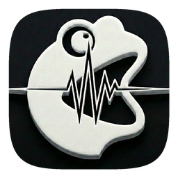

<div align="center">
  
  <h1>HoAh (吼蛙)</h1>
  <p>Recorder-first macOS dictation with optional cloud transcription and AI Actions.</p>
  <p>以录音器为中心的 macOS 听写应用，支持可选的云端转录与 AI Action。</p>

  [](https://www.gnu.org/licenses/gpl-3.0)
  
</div>

**English | [简体中文](#中文)** · [Website / 项目主页](https://hoah.app/)

---

<details open id="english">
<summary><strong>English</strong></summary>

## Overview

**HoAh** is a macOS dictation app built around a fast capture workflow:
1. Record audio with a keyboard-driven recorder.
2. Transcribe with a selectable speech-to-text backend.
3. Optionally run an **AI Action** step to clean, polish, translate, or answer based on the transcript.

The current codebase includes local `whisper.cpp` models, hosted transcription APIs, realtime streaming providers, configurable AI Action providers, history/export tooling, and data-retention controls.

## Practical Reality

- The Xcode project still targets **macOS 14.0+**, but the current app is much more realistic to use on **macOS 26+** if you want the project in its present shape to feel normal day to day.
- The Apple Speech path is built around newer macOS 26 APIs and build flags. Older supported macOS versions may still build or launch, but they are not the main reality this codebase is optimized around.
- Local models are not lightweight. `ggml-base` is the easiest local option; the `large-v3` family is much heavier and expects a strong Mac, ideally Apple Silicon with plenty of unified memory.
- If your Mac is lower-end, the practical path is usually smaller local models or cloud transcription instead of the largest local models.

## What The Current Codebase Includes

- **Recorder-first UX**: Mini recorder and notch recorder modes, configurable hotkeys, hold-to-talk / toggle workflows, optional middle-click trigger, menu bar mode, and App Shortcuts support.
- **Multiple transcription backends**: Local `whisper.cpp` models, cloud transcription providers, realtime streaming providers, custom OpenAI-compatible transcription endpoints, and a gated Apple Speech path.
- **AI Actions**: Built-in clean, polish, Q&A, and translation flows, including a second translation target and Polish-mode toggles such as Formal Writing and Professional / High-EQ.
- **Custom prompts**: Add your own prompts and optional trigger words instead of being locked to fixed modes.
- **History and export**: SwiftData-backed transcript history, search/filtering, audio playback, re-transcription from saved audio, CSV export, daily Markdown export, and optional automatic daily-log append.
- **Retention and privacy controls**: Keychain-backed secrets, transcript/audio cleanup controls, clipboard behavior settings, and security-scoped export-folder access.

## Transcription Backends

- **Local models**: `ggml-base`, `ggml-large-v3`, `ggml-large-v3-turbo`, `ggml-large-v3-turbo-q5_0`
- **Cloud transcription**: Groq Whisper Large v3 Turbo, OpenAI GPT-4o Transcribe, ElevenLabs Scribe v2 Batch
- **Realtime streaming**: OpenAI realtime transcription, ElevenLabs realtime transcription, Amazon Transcribe Streaming
- **Custom endpoints**: user-defined OpenAI-compatible transcription services
- **Apple Speech**: present in the codebase, but effectively gated behind macOS 26 APIs and build settings

## AI Action Providers

- OpenAI
- Azure OpenAI
- Gemini
- Anthropic
- GROQ
- Cerebras
- OpenRouter
- AWS Bedrock
- OCI Generative AI
- Ollama (local)
- Doubao / Ark-compatible configuration for Chinese UI

These are managed as saved configurations rather than a single global provider toggle. Secrets are stored in Keychain.

## Privacy And Networking

- Transcript history is stored locally with SwiftData.
- API keys and similar secrets are stored in Keychain.
- If you stay on local transcription plus local AI backends such as Ollama, you can avoid sending transcript content to third-party model providers.
- If you use cloud transcription or cloud AI Action providers, the relevant audio/text will be sent to those providers.
- Non-App-Store builds may still perform Sparkle update checks, so it is not strictly accurate to describe the app as "no network unless you configure a provider."
- Auto-export uses a user-selected folder with security-scoped bookmarks.

## Requirements

- Deployment target: **macOS 14.0 or later**
- Recommended everyday-use OS: **macOS 26 or later**
- Apple Silicon is strongly recommended for local-model usage
- Xcode with current Apple SDKs is recommended for development
- `whisper.cpp` XCFramework is required for source builds because the app links it directly

## Build From Source

1. Prepare `whisper.cpp`:

```bash
make setup
```

2. Configure code signing for your machine. The provided Make targets assume a valid development team:

```bash
DEV_TEAM=YOUR_TEAM_ID make build-debug
make run-debug
```

3. Maintainer-oriented shortcuts such as `make all` and `make dev` also assume your signing setup already works.

## Repo Docs

- [App Store release guide](docs/release/APP_STORE_RELEASE.md)
- [AI release instructions](docs/release/AI_RELEASE_INSTRUCTIONS.md)
- [Release notes](RELEASE_NOTES.md)

### License

This project is licensed under the GNU General Public License v3.0. See [LICENSE](LICENSE).

### Acknowledgments

- Core tech: [whisper.cpp](https://github.com/ggerganov/whisper.cpp)
- Core packages currently wired into the project: [Sparkle](https://github.com/sparkle-project/Sparkle), [KeyboardShortcuts](https://github.com/sindresorhus/KeyboardShortcuts), [LaunchAtLogin-Modern](https://github.com/sindresorhus/LaunchAtLogin-Modern), [mediaremote-adapter](https://github.com/ejbills/mediaremote-adapter), [Zip](https://github.com/marmelroy/Zip), [Swift Atomics](https://github.com/apple/swift-atomics)

</details>

<details id="中文">
<summary><strong>简体中文</strong></summary>

## 概览

**HoAh** 是一款围绕“快速采集”设计的 macOS 听写应用：
1. 用键盘驱动的录音器采集语音。
2. 使用可切换的语音转文字后端完成转录。
3. 按需进入 **AI Action** 阶段，对转录结果做清洗、润色、翻译或问答。

当前代码库已经不仅仅是“本地 Whisper + 可选 Prompt”。它现在包含本地 `whisper.cpp` 模型、托管转录 API、实时流式转录、可配置的 AI Action provider、历史/导出工具，以及数据保留控制。

## 实际情况

- Xcode 工程的部署目标仍然是 **macOS 14.0+**，但就当前代码状态来说，想“比较正常地日常使用”，更现实的建议是 **macOS 26+**。
- Apple Speech 这条路径依赖 macOS 26 的新 API 和对应编译开关。更早版本的系统也许还能构建或启动，但已经不是这个代码库当前重点优化和验证的主战场。
- 本地模型并不轻量。`ggml-base` 是相对容易跑起来的本地选项，`large-v3` 系列明显更重，实际更适合性能更强、统一内存更充足的 Apple Silicon Mac。
- 如果机器配置一般，更现实的选择通常是小一些的本地模型，或者直接使用云端转录，而不是硬上最大的本地模型。

## 当前代码库已经包含的能力

- **录音器优先的交互**：支持 Mini Recorder 和 Notch Recorder；可配置快捷键、按住说话 / 点按切换、可选中键触发、菜单栏模式，以及 App Shortcuts。
- **多种转录后端**：支持本地 `whisper.cpp` 模型、云端转录服务、实时流式转录服务、自定义 OpenAI 兼容转录接口，以及受限开放的 Apple Speech 路径。
- **AI Action**：内置 clean、polish、Q&A、translation 等流程，支持第二翻译目标，也支持 Formal Writing、Professional / High-EQ 等 Polish 开关。
- **自定义 Prompt**：除了内置模式，还可以新增自定义 Prompt，并配置 trigger words。
- **历史与导出**：基于 SwiftData 的历史记录、搜索筛选、音频回放、基于已保存音频的重新转录、CSV 导出、按天 Markdown 导出，以及可选的自动日记追加。
- **保留与隐私控制**：Keychain 存储密钥、转录/音频清理策略、剪贴板行为控制，以及基于 security-scoped bookmark 的导出目录访问。

## 转录后端

- **本地模型**：`ggml-base`、`ggml-large-v3`、`ggml-large-v3-turbo`、`ggml-large-v3-turbo-q5_0`
- **云端转录**：Groq Whisper Large v3 Turbo、OpenAI GPT-4o Transcribe、ElevenLabs Scribe v2 Batch
- **实时流式转录**：OpenAI realtime transcription、ElevenLabs realtime transcription、Amazon Transcribe Streaming
- **自定义接口**：用户自定义的 OpenAI 兼容转录服务
- **Apple Speech**：代码里已经有路径，但实际上仍受 macOS 26 API 与构建设置限制

## AI Action 提供商

- OpenAI
- Azure OpenAI
- Gemini
- Anthropic
- GROQ
- Cerebras
- OpenRouter
- AWS Bedrock
- OCI Generative AI
- Ollama（本地）
- 豆包 / Ark 兼容配置（中文界面可用）

这些能力通过“配置档”来管理，而不是一个单独的全局 provider 开关。密钥类信息存储在 Keychain 中。

## 隐私与联网说明

- 转录历史通过 SwiftData 保存在本地。
- API Key 等敏感信息通过 Keychain 存储。
- 如果你只使用本地转录和本地 AI 后端（例如 Ollama），可以避免把转录内容发送给第三方模型提供商。
- 如果你使用云端转录或云端 AI Action provider，相应的音频或文本会发送给那些 provider。
- 非 App Store 构建仍可能通过 Sparkle 执行更新检查，所以“除非你配置 provider 否则完全不联网”并不是严格准确的说法。
- 自动导出使用用户手动选择的文件夹，并通过 security-scoped bookmark 保持访问权限。

## 系统要求

- 部署目标：**macOS 14.0 或更高版本**
- 更推荐的日常使用系统：**macOS 26 或更高版本**
- 如果要认真使用本地模型，强烈建议 Apple Silicon 机器
- 开发建议使用较新的 Xcode 与 Apple SDK
- 由于工程直接链接 `whisper.cpp` XCFramework，源码构建需要先准备好这项依赖

## 从源码构建

1. 先准备 `whisper.cpp`：

```bash
make setup
```

2. 然后配置你自己的 code signing。当前 Makefile 默认假设你已经有可用的开发团队配置：

```bash
DEV_TEAM=YOUR_TEAM_ID make build-debug
make run-debug
```

3. `make all`、`make dev` 这类命令更偏向维护者工作流，也默认你本机的签名配置已经可用。

## 仓库文档

- [App Store 发布说明](docs/release/APP_STORE_RELEASE.md)
- [AI 发布说明](docs/release/AI_RELEASE_INSTRUCTIONS.md)
- [发布记录](RELEASE_NOTES.md)

### 许可证

本项目采用 GNU General Public License v3.0。详见 [LICENSE](LICENSE)。

### 致谢

- 核心技术：[whisper.cpp](https://github.com/ggerganov/whisper.cpp)
- 当前项目中已接入的核心包包括：[Sparkle](https://github.com/sparkle-project/Sparkle), [KeyboardShortcuts](https://github.com/sindresorhus/KeyboardShortcuts), [LaunchAtLogin-Modern](https://github.com/sindresorhus/LaunchAtLogin-Modern), [mediaremote-adapter](https://github.com/ejbills/mediaremote-adapter), [Zip](https://github.com/marmelroy/Zip), [Swift Atomics](https://github.com/apple/swift-atomics)

</details>
